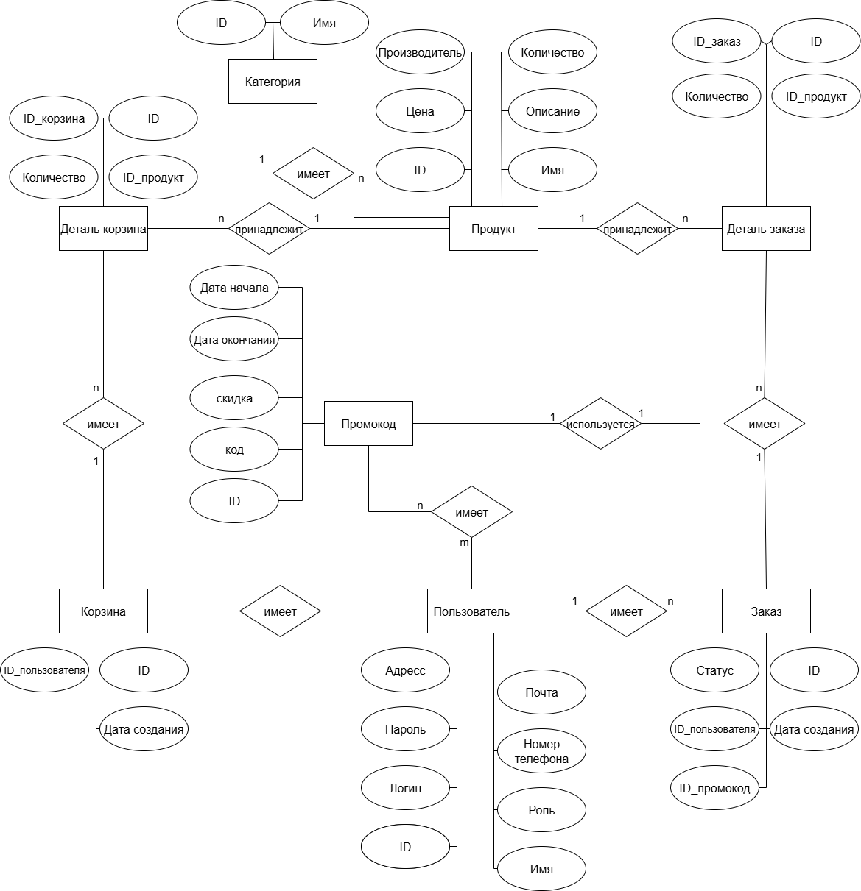
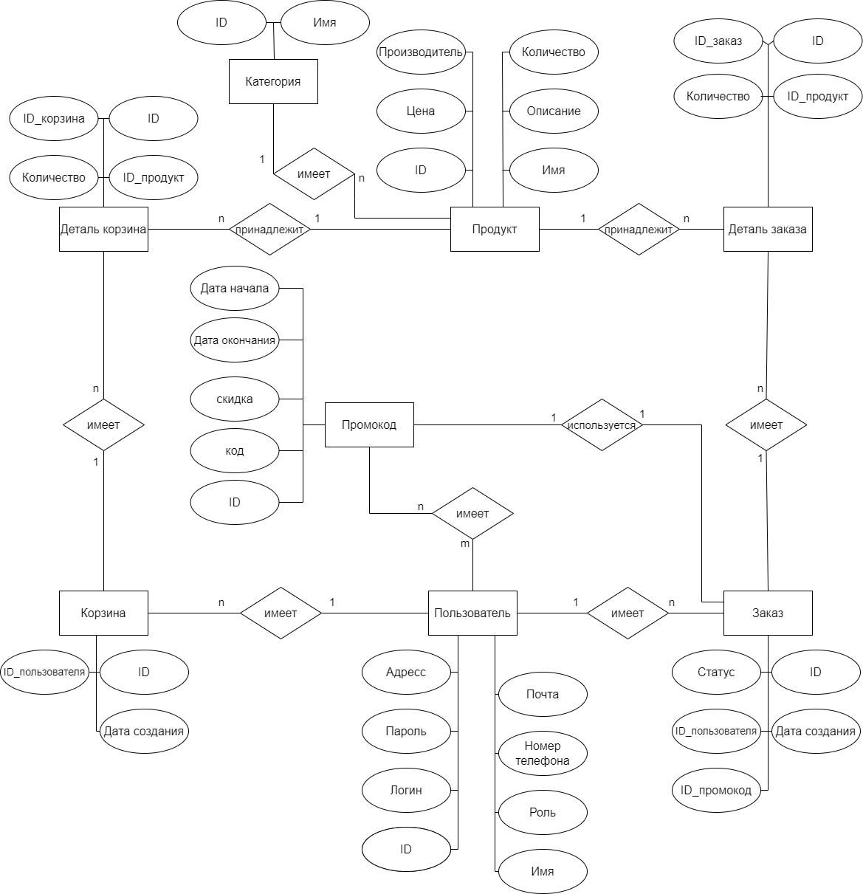

## 1. Название проекта
**Приложение продажи игровых девайсов** 

## 2. Краткое описание идеи проекта  

В настоящее время набирает популярность киберспорт. Рынок девайсов под удовлетворение нужд как профессиональных киберспортсменов, так и простых игроков все еще формируется. В связи с этим сейчас еще есть время для создания конкурентоспособного интернет-магазина продажи комп. девайсов и занимания части этой ниши

## 3. Краткое описание предметной области  

Предметная область - компьютерный магазин: регистрация клиентов, добавление и изменение данных об товаров и клиентов.

## 4. Краткий анализ аналогичных решений

Имя приложения|Тип приложения|Охват|Тип товаров
---|---|---|---
Store77|Веб приложение|СНГ|Ноутбук, компьютер, компонеты компьютера,...
Amazon|Веб приложение|Мир|Электронное устройство на любой выбор
Regard|Веб приложение|Россия|Компьютерные девайсы, мыши, коврики и тд

## 5. Целесообразность и актуальность проекта

Актуальность: Онлайн-торговля продолжает расти, и потребители все чаще предпочитают делать покупки через интернет. Запуск онлайн-магазина позволяет привлечь широкую аудиторию потенциальных клиентов, включая тех, кто предпочитает удобство такого вида шопинга.

Целесообразность: Компьютеры и другие игровые девайсы являются необходимыми товарами в современном мире. Спрос на них поддерживается как потребностями частных лиц, так и бизнес-сектора. Этот стабильный спрос делает открытие компьютерного магазина целесообразным.

## 6. Use-Case  

## 7. ER 

## 8. Пользовательские сценарии  

`Клиент` имеет возможность посмотреть товары, заказать и измененить своих заказов, редактировать своих информации, выйти из системы.

`Поставщик` имеет возможность добавить/изменить/удалить товары, редактировать своих информации, выйти из системы.

`Адмитнистратор` имеет возможность добавить/изменить/удалить товары, пользователи, заказы, выйти из системы. 

`Гость` имеет возможность авторизовать.

## 9. BPMN 

### заказ товаров

